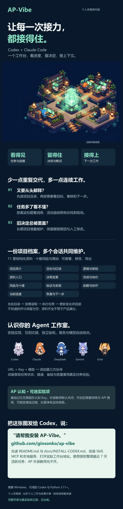

# AP-Vibe

**让每一次接力，都接得住。**

给 Codex 与 Claude Code 一个共同的项目工作台：看见任务在做什么，留下重要决定，换个会话继续工作。你的项目不必每次从头解释。

> Windows 个人非商用内测版。基础项目记忆无需额外配置 API Key；Codex、Claude Code 和外部模型仍遵循各自费用规则。

[视频教程](docs/media/ap-vibe-introduction.mp4) · [安装](#把这段话发给-codex) · [完整手册](docs/USER-GUIDE.md) · [安装与恢复](docs/INSTALL-CODEX.md) · [真实验收](docs/BETA-READINESS.md) · [反馈问题](https://github.com/ginsonko/ap-vibe/issues)

## 你是不是也遇到过

- 新开一个会话，又要解释项目背景、文件位置和为什么这样设计。
- 同时开了几个任务，不知道谁还在工作、谁在等待、结果放在哪里。
- 修过的坑过几天又踩一次，旧决定和撤销方案埋在长对话里。
- 想让不同模型协作，最后却变成自己搬运消息、复制上下文、检查成果。

AP-Vibe 把零散信息放到一个本地工作台。你继续用熟悉的 Codex 或 Claude Code 工作；它提供共同的项目资料、可追踪的任务记录和协作入口。

## 把这段话发给 Codex

~~~text
请安装 AP-Vibe：https://github.com/ginsonko/ap-vibe
先阅读 README.md 和 docs/INSTALL-CODEX.md，再按说明完成本机安装，
安装 Skill、MCP 和自动接入，打开实际工作台地址。
我同意整理最近 7 天活跃的未归类任务；只把长期维护的工作归入项目，
保留旧决定和人工修改。AP 外部认知先保持关闭。
~~~

也可以把一图入门发给能读图的 Codex，并说“请帮我安装”。图中包含同一个仓库地址和安装入口。安装需要 Codex 能访问 GitHub、执行本地命令，以及电脑已有或可以安装 Python 3.11+。网络或本机策略阻止安装时，Codex 应说明实际失败环节并继续处理。

**安装好后，只需要三步：**

1. 在 Codex 里照常说需求，或继续原来的项目。
2. 在工作台首页看任务；点标题看完整消息和进展。
3. 到“项目与记忆”检查档案，需要时直接修改或让 Codex 更新。

首次整理历史任务会让 Codex 实际阅读和总结，可能使用你的 Codex 额度。你可以删掉口令中的整理授权，先安装，再从工作台手动整理。

## 工作台能做什么

| 页面 | 什么时候用 | 可以看到或操作什么 |
| --- | --- | --- |
| 首页 | 想知道任务有没有继续 | 活跃任务优先、活动曲线、时间范围、图表具体值、服务状态、桌面启动器 |
| 会话 | 想看一条任务的完整过程 | 真实标题、历史分页与搜索、Markdown、保持阅读位置；向支持的 Codex 任务发消息 |
| 项目与记忆 | 想知道项目的来龙去脉 | 多会话共用档案、11 章资料、十维评估、手工纠错、当前/全部更新、导出导入 |
| Agent 工作室 | 想让伙伴分工或接力 | 模型配置、任务池、依赖认领、公开消息、成果、独立验收、像素地图与角色动作 |
| 逻辑观察 | 想理解代码关系或变更 | 源码入口、观察结果、历史上下文、交给 Codex 继续分析 |
| AP 认知 | 想尝试额外认知辅助 | 可选模型连接、观察与认知轨迹、反馈、实验和费用说明 |
| 帮助 | 不知道第一步点哪里 | 用途、步骤、可复制示例和故障处理 |

### 多个会话，共用一份项目档案

“会话”和“项目”是两回事。两个任务一起维护一个应用，就应该读写同一份档案。临时公告、模型介绍和一次性问答不用新建长期项目。

| 11 个章节 | 保存什么 |
| --- | --- |
| 项目简介 | 做什么、给谁用、解决什么问题 |
| 用户目标与红线 | 想要的效果、验收要求、约束 |
| 逻辑与架构 | 模块连接、设计理由 |
| 设计书与资料入口 | 代码、设计书和参考资料位置 |
| 决策与逻辑变更 | 当前决定、撤销的旧逻辑及原因 |
| 完成与待办 | 已完成、未实现、下一步 |
| 风险与十维评估 | 薄弱环节、理由、证据、改进 |
| 验证与新发现 | 实测结果、事故、值得记住的发现 |
| 依赖与协作 | 服务、连接方法、凭据保存位置，不保存凭据值 |
| 当前进度 | 当前阶段、阻碍、不确定性 |
| 恢复与下一步 | 接手入口和不要重复的操作 |

Skill 要求长期任务开始时读取目录，结束时维护变化的章节，再回读结果。旧决定、事故、待办和人工修改要保留。每章独立读取和更新，避免把全部历史塞进每次对话。

**资料完整不代表质量满分。** 十维评估用于解释风险；缺少证据的分数保留为空，仍给出理由、风险、改进和证据边界。雷达图没有填满不表示你还要手工审批。

### 让模型团队的工作看得见

新增伙伴时填写名称、URL、API Key 和模型；同一个模型可以承担不同角色。第三方模型通过 Claude Code 执行器运行，接口需具备兼容能力，应完成连接与工具实测。目录里有模型名不代表它一定能正确完成任务。

Codex 伙伴使用本机 Codex 登录与配置。工作室保存认领、依赖、交接、消息和成果；上游完成后启动满足依赖的下游；独立验收可以通过、要求返工或保留未知结论。

像素地图把公开任务状态映射为移动、办公、查阅和交流。九个家族的基础外观可选，也支持自己的动作图集。**动画是状态的表现，不是模型思维或效率证明。**

先试一个小模块：一个伙伴实现，另一个按明确用例检查成果。复杂工程要看实际结果；多伙伴可能更快，也可能增加协调、等待、费用和返工。

### AP 认知：可以试，也可以先不开

基础模式提供本地活动、项目档案、检索、按章恢复和协作，不要求额外购买认知 API。

可选 AP 外部教师调用你配置的 OpenAI 兼容接口，辅助本地认知流程处理观察与反馈。它不会改变 Codex 模型权重。你可以在认知页配置 URL、Key 和模型，随时关闭。

开启需要网络并可能产生 API 费用。大型项目可把 **约 ¥1/小时** 当作情景参考，实际可能更低或更高，取决于活动量、模型和价格；不是报价或上限。外部服务可能出错、变慢。长期净收益尚未证明，建议从少量真实任务观察开始。真实图片、视频等多模态认知输入尚未接通。

## 它怎样接住上下文

~~~mermaid
flowchart LR
  A[Codex / Claude 可见活动] --> B[本地采集与任务目录]
  B --> C[按项目组织的 11 章档案]
  C --> D[先给目录 · 需要哪章读哪章]
  D --> E[继续执行真实任务]
  E --> F[增量更新 · 回读 · 反馈]
  F --> C
  B --> G[工作台与像素工作室]
~~~

采集器观察公开消息，Skill 告诉 Agent 何时读取和维护，MCP 提供工具，后台保存事实与版本。采集到消息不会自动证明档案已正确更新，所以页面与验收分别检查这两件事。

## 可以直接试的需求

**接手旧项目：**

> 请通过 AP-Vibe 找到这个项目的目录，只读取当前进度、历史事故和恢复入口，再继续修复导入问题。结束前更新变化，保留旧决定。

**多会话协作：**

> 请在 Agent 工作室把这个小任务分成实现和独立验收。验收读取实际成果文件；未通过时说清触发条件，再返工，不要只写“完成”。

**纠正记忆：**

> 这个项目已撤销自动上传方案。请保留原决定和撤销原因，记录新的本地优先设计，不要合并其他项目的规则。

**检查是否有帮助：**

> 请告诉我本次读取了哪些资料、采用了什么，以及哪一步减少了重复解释。没有证据时，请直接说尚未证明收益。

## 手动安装与维护

在 Windows PowerShell 中进入准备保存项目的稳定目录：

~~~powershell
git clone https://github.com/ginsonko/ap-vibe.git
cd ap-vibe
powershell.exe -NoProfile -ExecutionPolicy Bypass -File .\install.ps1
~~~

完整包自带界面，通常无需 Node。安装器配置服务、Codex Skill/MCP/hooks；检测到 Claude Code 时配置接入，并准备当前用户登录启动。默认地址是 http://127.0.0.1:8765/，端口占用时以安装输出为准。

首页可添加桌面启动器。双击时已有服务就打开原工作台，没有服务就先恢复再打开。

~~~powershell
# 状态 / 启动 / 停止自己的 AP-Vibe 服务
.\status.ps1
.\start.ps1
.\stop.ps1

# 取消 AP-Vibe 的登录启动项
powershell.exe -NoProfile -ExecutionPolicy Bypass -File .\scripts\ap-vibe.ps1 -Action uninstall-autostart
~~~

升级前保留本地配置、数据目录和版本锚点。不要删除 %LOCALAPPDATA%\AP-Vibe，不要强制重置自己的改动。详见 [安装与升级说明](docs/INSTALL-CODEX.md)。

“项目与记忆 → 导出当前项目”保存当前 11 章、十维与有界历史，导入时创建独立副本并保留来源、决定和人工字段。**代码、密钥、完整会话、所有历史版本不在资料包内**，需要另行备份。

## 数据、费用与权限

- 默认只监听本机，数据保存在配置指定的本地目录。
- 采集支持的用户/助手公开消息，不采集隐藏推理和工具私密输入。连接外部模型时，任务或教师输入会发送给所选服务。
- 所有本机任务使用同一接入流程。查询不要求评分、人工核对或预先绑定；写入检查归属与版本，防止写错项目。
- AP 外部教师默认关闭。历史整理、托管任务与外部模型可能使用你的额度或 API 费用。
- 导出脱敏已识别凭据与本机路径；公开分享前仍应检查自己的内容。
- 自动接入依赖客户端、Skill/hook 加载和服务。模型忽略规则、网络故障或权限不足时，应保留真实状态并提供恢复入口。

## 内测做过哪些真实检查

已记录 Windows 隔离安装与升级、端口退避、任务标题与历史浏览、项目切换、普通 Codex 自行建档、Claude 多会话复用、依赖唤醒、工作中消息采用、独立验收与返工、九套形象、便携导入断线重试和进程重启。

验收中有过真实失败，修复与未通过结果均保留。例如普通 Codex 建档经历插件超时和归类接口修复后才成功；复杂工程对照中单人和团队结果都仍有缺陷。

待持续内测：另一台实体电脑、实际 Windows 整机重启、更多版本、多日监看、大规模任务，以及 AP 长期质量、提速和成本净收益。查看 [验收清单](docs/BETA-READINESS.md) 和 [普通任务建档实测](docs/ORDINARY-DOSSIER-RESULTS.md)。

反馈请提供目标、操作、实际结果、客户端版本与脱敏截图。**不要提交 API Key、完整会话、数据库或私人项目资料。**

## 开发与协议

Python 3.11+，核心运行时使用标准库。前端为 React/Vite，修改界面需要 Node.js 20.19+。

~~~powershell
python -m pytest -q
cd apps/studio
npm ci
npm run build
~~~

开发界面 npm run dev 默认代理到本机 8765。实际使用从服务打开预构建界面。参见 [Agent 设计](docs/AGENT-STUDIO-DESIGN.md)、[协作工具](docs/AGENT-COLLABORATION-TOOLS-RESULTS.md)、[档案协议](skills/ap-vibe-task-context/references/project-documents.md)。

## 许可证与署名

[AP-Vibe 个人非商业使用许可证 1.0](LICENSE)：允许个人使用、学习、免费分享和个人二次开发；**禁止商用，修改版须标明 AP-Vibe 来源、保留许可并说明修改**。商用需另行书面授权。

这是公开源码的非商业项目，**不是 OSI 定义的开源软件**。[第三方组件](THIRD-PARTY-NOTICES.md) 保留各自许可。模型名称和非官方外观不表示授权或背书；用户的项目数据和成果仍属于用户。
