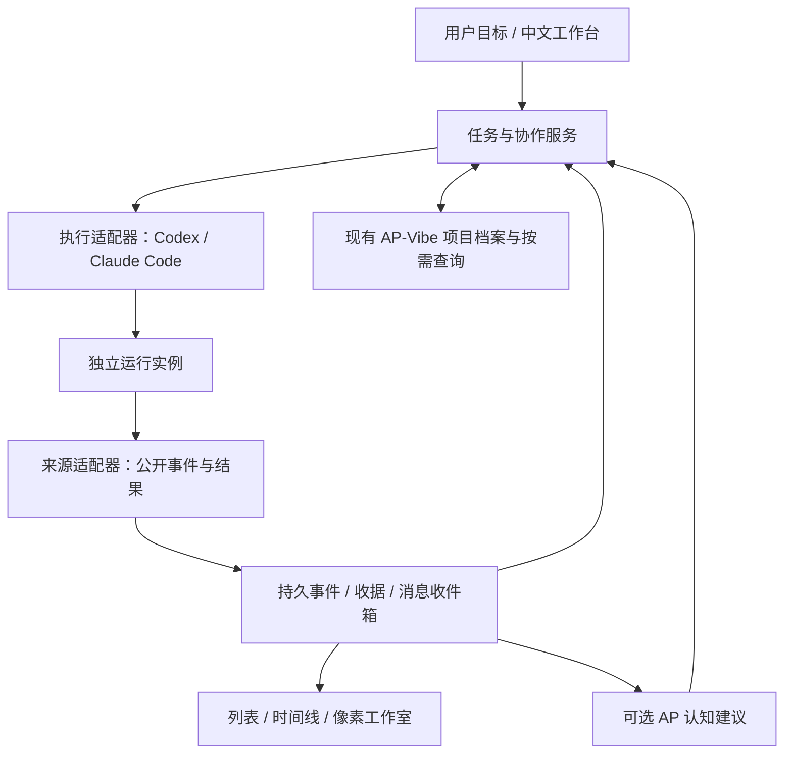

# AP-Vibe Agent 工作室：从项目记忆到跨工具协作

版本：设计候选 v1.0 · 2026-09-08  
状态：设计与对抗性自审完成，P0 已实现基础预览；High 模型的工具/项目上下文/会话接续已有真实结果，团队协作仍未实现。详见[基础实测记录](AGENT-STUDIO-P0-RESULTS.md)。以下阶段方案保留原设计边界。  
配套文档：[基础实验与推进计划](AGENT-STUDIO-FOUNDATION-TESTS.md) · [对抗性审查](AGENT-STUDIO-ADVERSARIAL-REVIEW.md)

## 1. 产品目标与判断

AP-Vibe 已围绕“不同任务接续同一个项目”建立本地工作台。下一步希望让不同工具、不同模型承担同一个项目里的不同工作，共享必要资料，交付可验收成果。用户仍然只需要说清目标、看进度和结果。

这个方向值得做。最有价值的部分是：项目记忆跨工具复用、独立工作并行、便宜模型完成边界清楚的任务、强模型集中处理规划和验收，以及中断后的可靠续接。像素工作室让过程容易理解并有趣，但收益首先取决于执行和协作是否可靠。

“更多 Agent”没有天然优势。简单修改直接由一个 Agent 完成；只有存在独立可验收子任务、可用能力和预计收益时才拆分。模型价格低也不等于总成本低，必须把规划、通信、重试、返工和最终验收一起计算。

本阶段的“跨平台”首先指 Windows 同机上的 Codex 与 Claude Code 两种工具。跨 Windows/macOS/Linux、跨机器联网协作是不同问题，另行验收。第一版不把本地工作台开放到公网。

## 2. 现有基础与证据边界

以下基础来自现有源码和本机命令检查，不代表新增链路已经跑通。

| 拼图 | 当前基础 | 可以复用什么 | 尚需验证什么 |
| --- | --- | --- | --- |
| 项目知识 | `project_documents.py`、任务上下文 Skill | 11 章、十维评估、按需读取、版本与人工修改保护 | Claude 真实调用、并发增量合并、跨工具采用效果 |
| Codex 会话 | 来源监看、`codex_messages.py` | 公开消息、持久发送队列、queue/resume 能力选择 | 混合团队的忙碌排队、休眠唤醒和完成回读 |
| 后台任务 | `organization.py`、`organization_runner.py` | 工作分片、失败保留、逐项目保存收据、重启恢复 | 扩展为通用任务前的接口抽离，不能直接把整理器当万能执行器 |
| 本地存储 | `product.py` 的 SQLite 事务 | 短事务、版本比较、历史保存 | 多执行器并发、任务所有权、通知事务 |
| 工作台 | `apps/studio` 中文多页 | 会话、项目、雷达、活动、帮助及恢复入口 | 增量事件性能、团队概览、角色状态、全按钮验收 |
| Claude Code | 本机 2.1.215 帮助 | 指定模型/会话、流式输入输出、MCP、hooks、配置和恢复参数 | 银子 API 第三方模型实际工具往返及可靠性 |
| AP 认知 | 现有感知/召回/行动相关实现及可选教师 | 对既有运行时增加协作事件和可追溯建议的接入设计 | SA 等对象如何承载新事件、建议的实际收益与成本 |

本机已看到 `--model`、`--name`、`--session-id`、`--resume`、`--input-format stream-json`、`--output-format stream-json`、`--include-partial-messages`、`--include-hook-events`、`--settings`、`--mcp-config` 等参数。它们只能证明 CLI 暴露入口。`claude agents` 的会话枚举、后台管理和具体可控范围仍需真实任务确认。

现有公开候选仍有真实 UI、安装、完整档案刷新和发布验收待办。新设计与它们分别记录，不把旧功能默认视为全部成熟。正文中的新增接口和数据对象均为拟议合同。

本轮设计档案维护还复现了一个基础缺口：bootstrap依据既有项目关联返回可写身份，但update因同会话存在另一个来源绑定而返回`task_context_membership_changed_bootstrap_required`，重新bootstrap仍无法提交。正文设计已保存在文件，档案patch保留等待补写。这表明多来源身份恢复与写入检查需要统一判定合同；不能在接入Claude时照搬矛盾逻辑，也不能简单删除归属检查来隐藏串项目写风险。

## 3. 用户实际怎么用

### 3.1 创建第一个 Agent

在“Agent 工作室”点击“添加伙伴”，首屏只显示：

1. 名称：例如“大肥鱼·前端”；可自动生成，用户能修改。
2. 服务地址：用户的模型服务 URL，界面给一个格式示例。
3. API Key：密码输入框，保存后仅显示已配置及更换入口。
4. 模型：可从服务返回的模型目录选，也能直接输入完整名称。

默认使用 Claude Code CLI。保存后自动检查本地 CLI、地址与协议配置，展示“正在检查连接”。第一次需要真实模型请求时，按钮文案提前说明会有少量 API 费用；用户执行“连接并验证”即授权这次检查，不再连续弹确认。当前项目所有者已授权后续基础实验，可直接按计划执行。

验证结果用中文说明实际能力，例如“可对话、可读写本地文件、可调用 AP-Vibe；图片尚未验证”。失败显示具体原因及下一步，如“接口能聊天，但尚未接受 Claude 的工具请求”，保留已填内容和检查收据。不能只显示“连接成功”就承诺可开发。

高级设置折叠：职责/偏好、头像、模型参数、并发、可选预算、协议方式、工具与目录范围。普通用户无需理解 Messages 或 stream-json。重复使用同一连接时可从已保存连接选择；同模型不同 Agent 共用 credential_ref，但运行状态、会话、提示和成果独立。

连接配置变更生成新版本，只对新运行生效；当前运行继续使用启动时的模型和配置快照。换模型必须显示实际生效时点。Codex 使用当前用户已有设置，本版只连接和唤醒，不改变其全局模型配置。

### 3.2 给团队一件事

用户在 Codex、接入的 Claude 会话或工作台输入：“给阅读记录项目增加搜索、导出，并检查手机布局。”

规划 Agent 读取项目目录和相关章节，判断依赖。搜索和导出若边界可分，则形成两个子任务；布局验收等待整合后的同一版本。用户看到“搜索开发 / 导出开发 / 整合验收”，不需要先建团队、填任务表或逐个授权认领。

卡片提供“查看对话”“查看成果”“补充要求”“暂停后续工作”。失败时提供对应动作，例如“修复连接后继续”“重新分配未完成部分”；不要让用户先点“准备”再点“开始”。已授权的项目内常规工作自动推进，外部发布等动作遵守原任务实际授权。

### 3.3 Agent 互相看到什么

默认共享同一用户本机已接入来源的目录、公开活动摘要和项目章节入口，不设“信任分数够了才允许读”的门槛。跨项目查询也可以，结果标注项目与来源。发给某个远端模型的上下文按当前任务需要选择，避免一次把所有项目内容发出去。

Agent 默认得到自己的任务卡、项目目录、相关依赖结果和定向未读消息。需要时再读取活跃任务列表、某个 Agent 的近期公开输出或完整公开上下文。会议视图按话题串联分歧、决策、证据和结论；不把每个字符广播给所有模型。

共享的是用户可见消息、工具执行状态、获准分享的成果和脱敏错误摘要。隐藏推理、Key、进程环境和原始工具参数不进入公共活动。文件内容是否交给远端模型由任务范围和执行工具决定，不能借“监控”全量上传本机资料。

### 3.4 普通终端也有合理体验

“已观察会话”和“工作室托管会话”是两个能力等级：前者可查看公开活动；后者由 AP-Vibe 启动或通过可靠协议接管，才能排队输入、暂停与恢复。发现一个日志文件不意味着可以向它的终端安全输入。

普通 Claude 会话安装接入 Skill/MCP 后，能主动查资料、登记任务和发送协作消息。对暂时没有可靠消息入口的既有终端，界面明确显示“仅监看”；可提供安装接入或新建协作任务的直接入口。即使该会话暂不可控，查询能力仍可使用。

## 4. 模块划分：复用现有基础，新增清楚边界

模块先做本地 Python 包和现有前端页面，不为模块化引入微服务或新数据库。默认复用 SQLite 短事务、现有服务发现和启动器。

| 模块 | 职责 | 不承担的职责 |
| --- | --- | --- |
| SourceAdapter | 发现来源，读公开增量，记录 cursor 和心跳 | 不凭日志推断成功，不负责杀进程 |
| ExecutionAdapter | 创建、输入、恢复、请求停止、能力发现 | 不决定项目真相，不替所有模型宣称兼容 |
| ProviderProfile | URL、协议能力、模型、credential_ref、配置版本 | 不保存公开明文 Key，不改系统全局环境 |
| CollaborationService | 任务依赖、认领、交接、投递、唤醒 | 不让模型自评替代验收，不形成第二套 AP 认知 |
| ArtifactService | 基线、成果清单、差异、整合和测试收据 | 不把另一分支测试套在最终版本上 |
| KnowledgeBridge | 复用章节查询和增量档案更新 | 不把每段聊天都变长期记忆 |
| APBridge | 既有 AP 原生对象映射、建议、采用与结果反馈 | 不拥有投递事务、权限判定或未经验证的真相 |
| StudioProjection | 从真实事件生成页面与动画状态 | 不触发工具，不因重播重复业务动作 |

适配器提供有版本的能力表：discover、observe、spawn、stream_input、send_when_idle、resume、cooperative_stop、force_stop_owned、usage、media_input。能力未知保留 unknown，局部失败只影响相关按钮。协议升级允许保留未知事件类型和脱敏摘要，不因新字段使整个会话白屏。

默认非 Codex Agent 使用 Claude 执行器。若实验证明某种模型的必要语义无法适配，先标明限制，保留模型配置和已得成果。需要新执行器时沿同一接口新增；不能悄悄换执行器或模型继续计费并假装配置原样生效。

## 5. URL、Key、模型背后的兼容设计

Claude Code 通常需要 Anthropic Messages 及其流式、工具调用和工具结果语义。用户服务若只提供 OpenAI 格式，不能仅替换模型名称就视为兼容。

推荐顺序：用户显式协议设置优先；否则利用已知服务能力/模型目录和最少请求检测原生兼容；仍不满足时尝试已实现并验证过的本地协议适配器。能力探测按 URL、模型、适配器版本、CLI 版本缓存，失败可重新检测，不维护硬编码模型准入白名单。

适配器必须处理：system/user/assistant 内容块、tool_use/tool_result ID、流式分片合并、停止原因、错误、用量、上下文压缩后的工具配对、多模态输入以及必要的 thinking/签名字段语义。不能伪造签名、把推理块当正文或把缺失工具结果补成成功。Chat Completions 与 Responses 分开适配，某一种通过不代表另一种通过。

CC 可能存在辅助请求或默认子模型选择，实验必须捕获脱敏后的实际模型标识及出口，确认不会悄悄使用其他账号或默认 Claude 模型。候选映射逐项说明，不能声称只设主模型便隔离全部费用。网关返回的 model 只作供应方声明，不能证明其底层权重身份。

每次启动创建独立子进程环境和受限运行目录，不修改用户现有 Claude 全局设置，不把 Key 放到命令行参数。Windows 凭据采用当前用户可恢复的系统加密存储，运行时按 credential_ref 解密传入必要子进程；限制句柄继承，日志、崩溃报告、导出、备份默认排除明文。磁盘加密不能防范同一用户下的恶意进程，说明其实际保护范围。

Key 删除/轮换不清除历史任务成果。新运行采用新凭据，旧运行需要停止或重建才能确保旧值失效。多机迁移默认要求重新配置凭据，不把 DPAPI 文件复制到新机器当作已完成恢复。

## 6. 数据合同与恢复不变量

| 对象 | 关键字段与含义 |
| --- | --- |
| AgentProfile | agent_id、name、avatar_id、executor、provider_profile_id、model、职责偏好、config_version；表示可复用角色 |
| AgentRun | run_id、agent_id、配置快照、provider_session_key、process_identity、workspace、lifecycle；表示一次真实运行 |
| Session | host_id、provider、session_id、source_kind、title、capabilities、cursor；会话不等于角色或项目 |
| Task | task_id、project_id、目标、输入、交付物、验收条件、dependencies、owner、assignment_epoch、version、state |
| Message | message_id、sender、recipient、task_id、kind、correlation_id、reply_to、body_ref、delivery_state |
| Event | event_id、source、source_seq/cursor、observed_at、occurred_at、schema_version、task/run refs、公开载荷 |
| Artifact | artifact_id、task_id、base_revision、内容引用/hash、修改范围、验证收据、整合版本 |
| Handoff | 原/新 owner、checkpoint、未完成范围、外部操作状态、epoch、确认状态 |
| WakeSubscription | 目标会话、条件/依赖集合、generation、已发送水位、outbox_id |
| KnowledgePatch | request_id、project_id、expected_revision、章节变化、来源、user_edit 保留、提交收据 |

显示名称允许重名；一切操作使用稳定 ID。会话主键含 provider，避免 Codex 和 Claude ID 碰撞；host_id 预留后续扩展。时间戳用于展示，排序和去重采用来源序号及入库序号，不能假定各来源时钟同步。

核心不变量：

1. 同一任务当前只有一个有效 owner/epoch。模型说“我认领了”必须由原子比较更新成功后成立。
2. lease 到期只说明失联；先核对原运行及副作用，不自动让第二个 Agent 重做正在付费或写外部系统的动作。
3. 结果与事件先持久保存，再确认接收或发出完成唤醒。数据库提交和待发送 outbox 在同一事务。
4. 至少一次事件投递配合消费去重；不宣传跨文件、数据库、外部 API 的全局 exactly-once。
5. 同一次不确定请求不换新 ID 重发；先查询收据，能证明未提交才重试。不同语义的新请求另建 ID。
6. 旧 owner 的结果不能覆盖新任务状态，但有效成果进入候选/冲突队列，避免辛苦完成的工作丢失。
7. 来源断流保留最后成功信息及时间；未知不能显示成零、失败或休息。
8. 历史项目和档案原地保留，新表采用可回退迁移。迁移前备份，回退需保留新事件；不盲目降级数据库。

## 7. 任务、消息、交接和唤醒

### 7.1 任务状态

`待拆解 → 待依赖/可认领 → 执行中 → 待验收 → 已完成`。

分支包括“等待用户/服务”“暂停”“恢复核对中”“取消中”“已取消”“失败”。“进程退出”“模型说完成”“API 已接收”都不是任务已完成。完成要求交付物可定位、适用验收通过、必要档案更新有收据；若用户主体成果已交付而档案服务故障，分别显示“成果已交付，档案待补”，不扣留结果、不无限拉起模型补档案。

进度优先显示可证据化计数：3/5 子任务完成、2 个待验收、1 个等待接口。没有测量依据不显示随时间自动增长的百分比。

### 7.2 认领与主动协作

规划产出目标、边界、依赖、输入来源、成果格式、验收方法、可改文件/资源范围。任务不是一句“帮忙做前端”。用户补充要求生成任务版本，依赖该变化的运行收到定向通知。

空闲 Agent 收到可认领任务事件或主动查询一次匹配列表，提出认领；事务校验依赖、版本与资源冲突后确认。默认只在本项目可执行范围接活，跨项目读取不受此限制。角色偏好是排序先验，不禁止用户指定其他模型尝试。

认领后其他 Agent 立即看见归属。即便两个角色同时请求，只有一个成功；失败者拿到最新任务目录。依赖图在提交时检查环，动态拆分还要检查祖先链，避免 A 等 B、B 又等 A。

### 7.3 消息投递

应用层区分“已保存”“等待接收方空闲”“已交给执行器”“对方已确认收到”“已回复”“投递结果待核对”。进程 write 成功仅代表交给执行器。每次收件携带 message_id，回复或工具确认关联原消息。

会议按任务话题建立定向消息串。事实更新、求助、方案异议、认领、交接和验收结果有明确类型；普通聊天不自动触发全员讨论。回复不自动回复自己，重复内容聚合；长讨论由负责人形成有来源的结论。用户可看详细历史和未解决分歧。

既有运行能否即时输入由适配器能力决定：支持流式输入则排队投递；只支持 turn 边界则等当前工作告一段落。每个 session 保持一个输入/恢复拥有者，不能在活跃的同一会话上另起 resume 进程竞争。

### 7.4 卡住时怎么帮忙

无文本输出可能在执行测试、等待工具或等待权限。先查询进程/工具状态、心跳、队列、实际阶段与最近成果。Agent 可以提出“需要帮忙”“拆出这段工作”“建议接手”，协调器用已知状态做转移，不允许 Agent 互相无限强停。

交接顺序：提出范围 → 原 owner 保存 checkpoint/未提交修改/外部操作状态 → 确认释放 → 原子转移 epoch → 新 owner 读取并继续。原 owner 已崩溃时先核对工作目录、工具进程和外部请求；纯本地可重放操作恢复，未知外部结果等待对账，同时其它独立任务继续。

只有适配器确认属于本次托管运行的进程树才可终止，记录进程创建标识防 PID 复用；不按 python/node/claude 名称批量杀进程。超时是可配置诊断信号，不因“一分钟没说话”认定低效。用户显式取消优先，已提交外部动作仍记录后续结果。

### 7.5 等大家完成再唤醒

规划 Agent 派发后注册依赖完成条件，本地服务记录订阅，然后结束当前模型回合。服务通过 CLI/公开事件接收变化；需要轮询时只做本地有界轮询，不反复花模型额度问“完成了吗”。

终态事件和 outbox 同事务写入。全部依赖达到条件或出现可行动失败时，合并成一条带任务版本、成果入口和失败摘要的唤醒消息。接收方忙则排队，离线则持久保留。重启按水位恢复，不漏发也不凭重启重发整轮验收。动态新增依赖使旧 generation 失效，防止验收过早启动。

“自动唤醒”不意味着用户登录失效、电脑关机或订阅耗尽时还能运行；界面显示原因，环境恢复后继续。同一终态通知不能同时唤醒原会话和替代会话各做一次验收。

## 8. 并行成果怎么安全变成一个结果

有 Git 的项目优先给写代码的 worker 独立 worktree/分支，记录同一基线、任务范围、工具依赖和输出位置。代码整合由指定角色按依赖顺序执行，冲突返回明确修改任务；整合后在最终版本验收。

非 Git 项目使用任务输出目录和目标文件清单，先做差异合并；无法隔离且重叠写入的部分串行。数据库、端口、服务、外部资源不因为工作树独立而隔离，任务必须记录这些共享资源。已有未提交用户修改作为基线证据保留，不重置或清理。

临时工作树只在成果持久保存并确认无未收集修改后清理，可恢复窗口可配置。删除 Agent 角色仅归档配置；默认保留任务、会话、成果与项目档案。模型切换也不改变旧成果的作者和实际模型标识。

## 9. Skills/MCP 与档案持续维护

安装采用同一知识协议、两套宿主接入：Codex 沿用现有 Skill；Claude 新增适配入口和 MCP 配置。启动、恢复、目标改变返回紧凑简报：当前项目、档案版本、11 章目录、活动任务、未读定向消息、当前分工及待补项。

拟议工具族为 `project.catalog/read/patch`、`agents.list`、`tasks.list/claim/progress/submit`、`messages.send/inbox/ack`、`handoff.request/checkpoint`、`watches.register`、`artifacts.read`。最终名称可调整，但返回必须有稳定 ID、结果状态、来源、下一读取入口和可重试说明。

没有注册项目时，Agent 先依据代码根、用户目标及已有证据匹配长期项目；不按相似标题自动合并。适合持续维护才创建完整档案，一次性公告等不强行建项目。未分类也能查资料和完成普通任务。

结束时检查 11 章是否有真实内容及十维评估是否有理由、风险、改进和证据边界。新决策、撤销逻辑、事故、连接位置和验证历史追加；整体架构/状态结合全项目更新。没有变化的章节不重写，未知分数保持 null。11 章有键与内容可用分别验证，不靠模板填充达标。

多个 worker 提交章节增量及事实证据，由项目合并流程基于 expected_revision 合并。人工章节保留；冲突重读最新再合并，历史收据不丢。优先复用现有文档协议，不能让每个 Agent 建自己的影子项目档案。

Skill 是指导，不能保证所有模型永远遵守。托管任务由终态处理检查收据，缺失时先复用已有 patch，无 patch 时定向要求补充缺项；同版本同原因合并为一个待办，有限尝试后落盘待补。普通外部会话只能依靠可用 hooks/主动 MCP 及事后观察，界面标注其真实维护状态。不要用无限 Stop hook 消耗模型来伪装强制完整性。

## 10. AP 在团队里承担什么

基础协作、搜索、消息、项目档案和恢复均可在 AP 外部教师关闭时运行。新增协作不得强迫用户配置第二套模型费用。

AP 可选认知适合处理有反馈的建议：根据任务结果与返工原因更新对模型/角色能力的认识；发现长期重复卡点；提出调度、上下文选择、交接或风险观察建议。它消费带来源的协作事件，输出可解释建议，再记录是否采用以及真实结果。

施工前建立现有 AP 的感知、SA、感受/情绪慢量、行动器、行动节点和范式注册清单，逐项查到现有运行时入口；不能只在前端画几个字段表示已经接通。新协作事件按既有对象协议注册，不写一套同名替代认知。AP 关闭后消息和任务事务仍完整。

情绪慢量只能作为 AP 内部调节状态及实验观察，不等于外部模型有可测的人格/情绪，也不能仅据此停止另一个 Agent。调度安全约束属于协调服务，不能交给认知预测决定。

页面使用独立“AP 认知实验”入口，展示：建议及依据、采用/未采用、结果、错误案例、观察样本量、调用用量与费用。开启提示网络、API 费用、可能变慢/出错、长期积累才可能产生收益；“大型项目约 1 元/小时”只能作为此前讨论的参考情境，不能作价格保证。当前单价、模型、调用频率和未知费用独立显示。

不设置硬编码每小时 300 次调用上限。并发、资源限制、供应方限流与用户可选金额预算分别处理；用户预算可为空。避免循环讨论和重复重试有必要，但不能把它变成任意读取限制。费用未知显示未知，不显示零。

## 11. 模型模板、能力认识与成本

发布可包含“DeepSeek · 大肥鱼”“Kimi · 长文助手”等可编辑模板示意，但最终模型 ID 必须由发布时目录和实测决定。名称、职责是起始建议，未经对照不能宣称某模型一定擅长。模板不带 Key，不要求使用某一个中转服务，用户可添加未知模型。

能力表保存：用户先验、可用工具/模态、实测任务类别、样本数、成功与返工、墙钟时间、计费/估算/未知、CLI/服务/模型版本和证据日期。新模型没有历史时用 unknown 和小任务探索；失败不永久拉黑。用户指定角色后仍遵守任务能力要求并说明具体限制。

同一模型的多个实例可以并行，但“两个都同意”不构成独立证据；最终评审依赖验收条件、运行结果和反例。同供应路由背后的模型是否独立也不推测。

默认从“一个负责人 + 两个可独立工作的 worker + 按需验收”实验，负责人可兼任最后验收而不再创建常驻规划/验收进程。并行数是可配置资源选项，按机器和服务响应调整；不为了动画好看强行凑人数。

收益用单 Agent 对照验证。分别报告 API 现金、订阅用量/可用额度、未知费用、总耗时、人工介入、质量与返工。不能把 Codex 订阅当免费、把没有金额字段当零成本。具体实验见配套矩阵。

## 12. 像素工作室：让真实过程看得懂

新增“Agent 工作室”页面，保持现有首页与项目页。首屏是任务目标、正在做什么、谁在等待、需要用户处理什么；地图与普通任务列表可切换，用户最后的选择记住。

| 区域 | 真实依据 | 动画与交互 |
| --- | --- | --- |
| 管理办公室 | 规划/拆解任务阶段 | 角色看白板；点击打开任务依赖与决定 |
| 前端办公区 | 当前任务职责或显式阶段为前端 | 角色到工位；点击看差异和公开对话 |
| 后端办公区 | 后端实现阶段 | 工位办公；查看接口和成果入口 |
| 资料查阅区 | 资料研究/上下文读取阶段 | 翻书；查看所用章节和来源 |
| 验收测试区 | 正在运行验证或评审 | 检查台；看到测试结果和版本 |
| 交流区 | 协作消息/方案会议事件 | 走近、冒气泡；点击完整消息串 |
| 等待区 | 依赖、网络或授权等待 | 明确原因；不显示为已休息 |
| 宿舍/休息区 | 已结束且无待办、空闲 | 休息；可分配新任务 |

角色位置来自阶段事件和用户可编辑区域映射。来源不能判断时显示“处理中/阶段未知”，保留最近真实状态；不根据一句关键词谎称正在跑测试。细颗粒工具状态由适配器提供脱敏阶段摘要，过密事件合并，避免角色每秒折返。

移动用本地路径寻路、空闲/走路/工作 sprite 和固定帧率上限。消息一落盘即投递，走路只是同时播放的表现；收件人关闭地图也照常收到。大量角色聚合，地图不可见时暂停动画；减少动态模式直接切位，键盘与屏幕阅读器能获取同样状态，状态不只靠颜色。

“大肥鱼”采用原创胖鱼轮廓和配色，参考梗的趣味而不复制来历不明的贴图。角色资产可配置名称、静态头像、四方向行走、工作、休息、交流状态；一套素材可给多个 Agent 换配色。固定 Codex 形象也用原创标识，避免暗示官方背书。

Image2 用于生成角色设定与素材候选；后处理统一调色板、透明背景、脚底锚点、尺寸和图集。真实预览检查边缘、帧间身份一致性与动作衔接；不承诺生图一次就产出可直接用的完美 sprite。附资产来源/生成记录/许可清单。素材生成由用户单独选择，不因创建 Agent 自动产生生图费用。

## 13. 分期与验收原则

推进顺序是基础实验 → 最小可靠协作 → 模型与恢复扩展 → 像素工作室 → 可选 AP 效果实验与内测。每阶段只验证下一阶段依赖的真实路径，失败定位第一个断点后修复再测受影响场景，不无限扩展测试。

首个纵向目标：创建两个同模型不同名称的 Claude Agent，从 AP-Vibe 读取同一个测试项目，认领两个独立任务，交换一条消息，产出成果；本地服务等完成后唤醒已有 Codex，由 Codex 验收同一整合版本，增量维护并回读项目档案。

该纵切通过以后才值得扩展角色地图和自动调度学习。具体步骤、证据格式、失败分支、效益对照和内测退出条件见[基础实验与推进计划](AGENT-STUDIO-FOUNDATION-TESTS.md)。

本轮完成的是设计文档。尚未证明 Claude 第三方模型工具链、任意独立终端可控、团队更快更便宜、AP 长期学习收益或公开安装可用。后续报告必须依据真实实验逐项改变状态。
